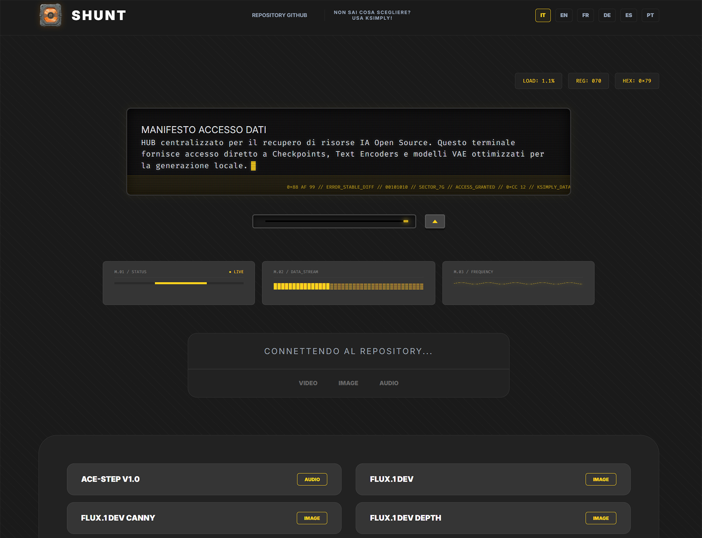
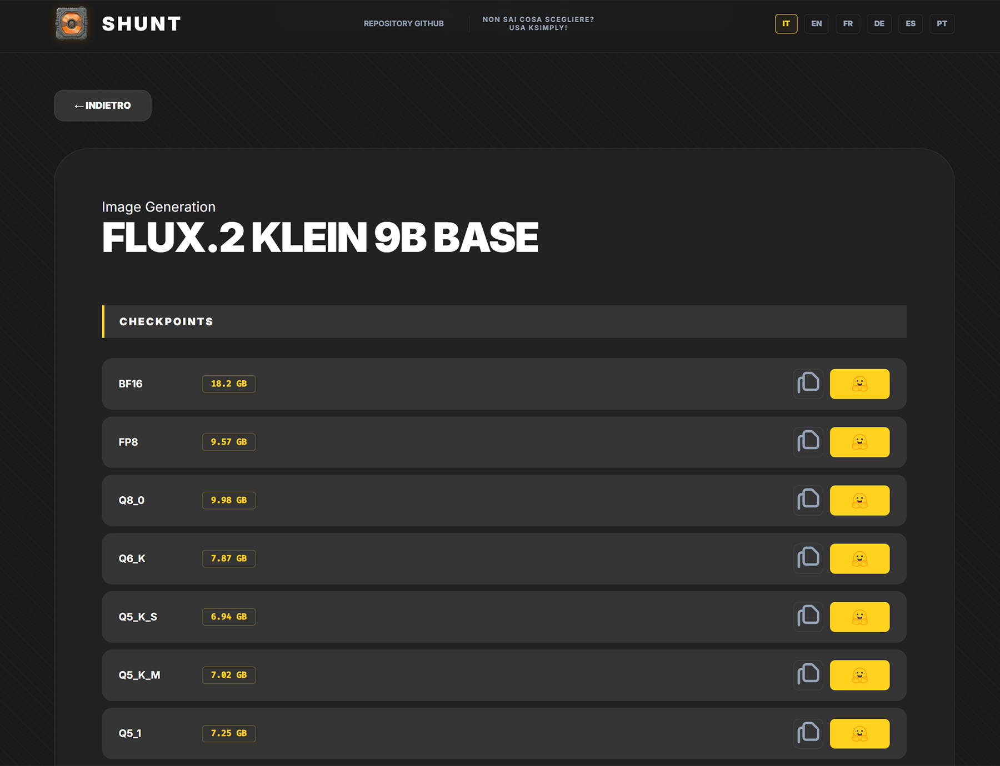
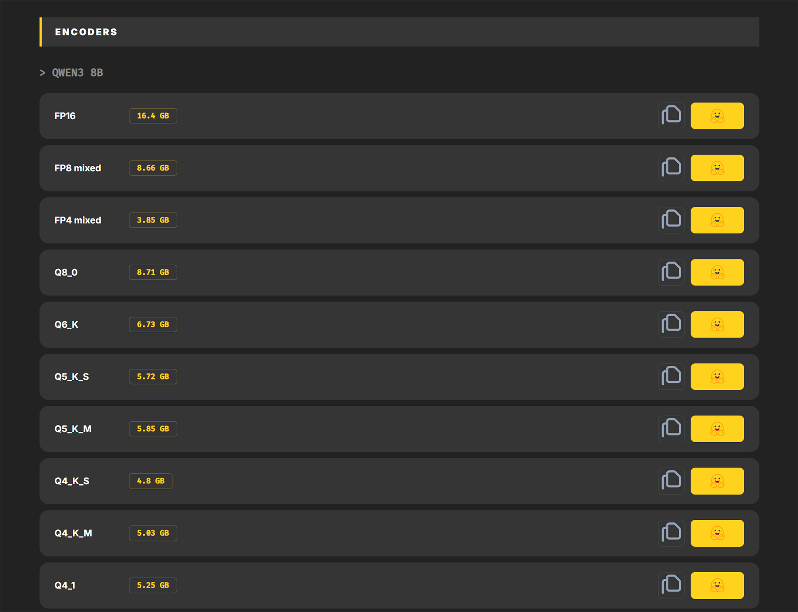

  
   
  <strong>Centralized Terminal for Open Source AI Resources</strong>
   
  <i>L'anello di congiunzione tra le risorse AI e il tuo workflow locale.</i>
   

[![Stargazers][stars-shield]][stars-url]

[![Issues][issues-shield]][issues-url]
[![MIT License][license-shield]][license-url]
[![LinkedIn][linkedin-shield]][linkedin-url]

### ✨ [Cerca nel database! / Search the database!](https://d4n-87.github.io/SHUNT/)) ✨

---

## 🖼️ Anteprima / Preview

| 🇮🇹 Pagina iniziale / 🇬🇧 Home page | 🇮🇹 Card modello / 🇬🇧 Model card | 🇮🇹 Encoder / 🇬🇧 Encoder |
| :---: | :---: | :---: |
|  |  |  |

---

## 🇮🇹 Versione Italiana

### 📌 Cos'è SHUNT?
**SHUNT** è un HUB tecnico progettato per semplificare il recupero di modelli AI open source. Invece di navigare nel caos dei repository globali, SHUNT agisce come un terminale di smistamento (bypass), fornendo link diretti e organizzati a:
*   **Checkpoints** (Modelli principali)
*   **Text Encoders** (CLIP, T5, ecc.)
*   **VAE Models** (Ottimizzatori visivi)

Il progetto è nato per essere il compagno ideale di [KSimply](https://github.com/d4N-87/KSimply): se KSimply ti consiglia la combinazione migliore, SHUNT ti fornisce i file per costruirla.

### 🚀 Caratteristiche
- **Interfaccia Industriale:** Design ispirato ai terminali retro-future (stile Alien/Weyland-Yutani).
- **Ricerca Intelligente:** Filtri rapidi per categoria (Video, Image, Audio).
- **Multilingua:** Supporto completo per ITA, ENG, FR, DE, ES, PT.
- **Dati Dinamici:** Pescaggio automatico dei dati dal database centralizzato di KSimply.
- **Copia Rapida:** Copia istantanea degli indirizzi repository con un click.

### 🛠️ Come si usa
1. Accedi alla web app (tramite GitHub Pages).
2. Usa la barra di ricerca o i filtri per trovare il modello desiderato.
3. Entra nella scheda dettaglio per vedere tutti i componenti compatibili (Encoder/VAE).
4. Clicca sull'icona **Hugging Face** per scaricare o usa il tasto **Copy** per ottenere il link.

---

## 🇺🇸 English Version

### 📌 What is SHUNT?
**SHUNT** is a technical HUB designed to streamline the retrieval of open-source AI models. Instead of navigating through the chaos of global repositories, SHUNT acts as a shunting terminal (bypass), providing direct and organized links to:
*   **Checkpoints** (Main models)
*   **Text Encoders** (CLIP, T5, etc.)
*   **VAE Models** (Visual optimizers)

This project was built to be the perfect companion for [KSimply](https://github.com/d4N-87/KSimply): while KSimply advises you on the best setup, SHUNT provides the files to build it.

### 🚀 Features
- **Industrial Interface:** Design inspired by retro-future terminals (Alien/Weyland-Yutani style).
- **Smart Search:** Quick filters by category (Video, Image, Audio).
- **Multi-language:** Full support for ITA, ENG, FR, DE, ES, PT.
- **Dynamic Data:** Automatic data fetching from the centralized KSimply database.
- **Quick Copy:** Instant copying of repository addresses with one click.

### 🛠️ How to use
1. Access the web app (via GitHub Pages).
2. Use the search bar or filters to find the desired model.
3. Open the detail card to see all compatible components (Encoders/VAEs).
4. Click the **Hugging Face** icon to download or use the **Copy** button to get the link.

---

## ❤️ Supporta il Progetto / Support the Project

🇮🇹 Se SHUNT ti è stato utile, considera di supportare il progetto. Ogni contributo aiuta a mantenere il sito attivo e a finanziare lo sviluppo di nuove funzionalità!

🇬🇧 If you found SHUNT useful, please consider supporting the project. Every contribution helps keep the site running and funds the development of new features!

  
    
  

# Star History

---

## 📄 Licenza / License

🇮🇹 Questo progetto è rilasciato sotto la Licenza MIT.

🇬🇧 This project is released under the MIT License.

<!-- Link di Riferimento per i Badge (vanno alla fine del file) -->
[stars-shield]: https://img.shields.io/github/stars/d4N-87/SHUNT?style=for-the-badge
[stars-url]: https://github.com/d4N-87/SHUNT/stargazers
[issues-shield]: https://img.shields.io/github/issues/d4N-87/SHUNT?style=for-the-badge
[issues-url]: https://github.com/d4N-87/SHUNT/issues
[license-shield]: https://img.shields.io/github/license/d4N-87/SHUNT?style=for-the-badge
[license-url]: https://github.com/d4N-87/SHUNT/blob/main/LICENSE
[linkedin-shield]: https://img.shields.io/badge/-LinkedIn-black.svg?style=for-the-badge&logo=linkedin&colorB=555
[linkedin-url]: https://www.linkedin.com/in/danielenofi
